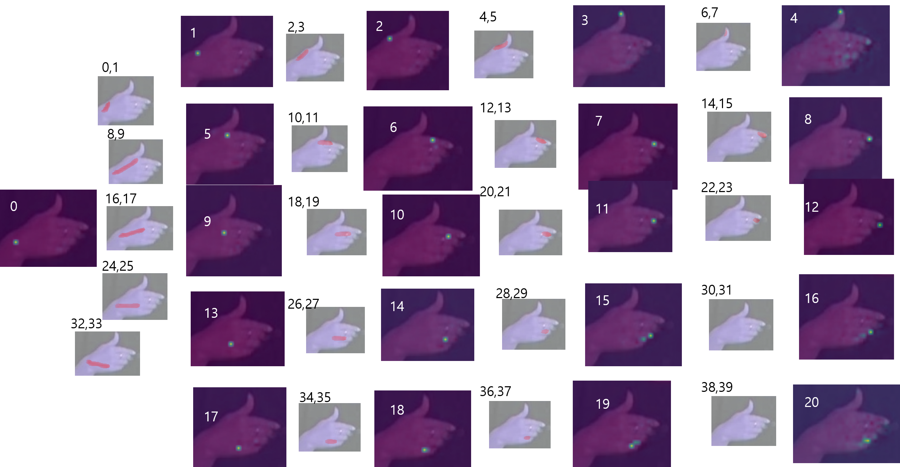

# Hand_Keypoint_Detection
reference paper : http://openaccess.thecvf.com/content_cvpr_2017/papers/Simon_Hand_Keypoint_Detection_CVPR_2017_paper.pdf

1. The Network Architecture

2. Dataset
To train this network, I use MPII Hand keypoint dataset.
Datset Information is here.
In annotation file, there is 21 keypoints information. And we could get 20 limb data by using 21 keypoints.

3. Training

The upper graph is loss of confidence map, and the lower graph is loss of PAFs.

4. Output
I could get these output.
First is image with representing keypoint.

And the second is image with representing PAFs with arrows.

The Confidencemap's size is [44x44x22]. And PAFs's size is [44x44x44].
So, I could get 22 confidencemaps and 44PAFs.
Like this.

And, finally we could get these output

5. etc
